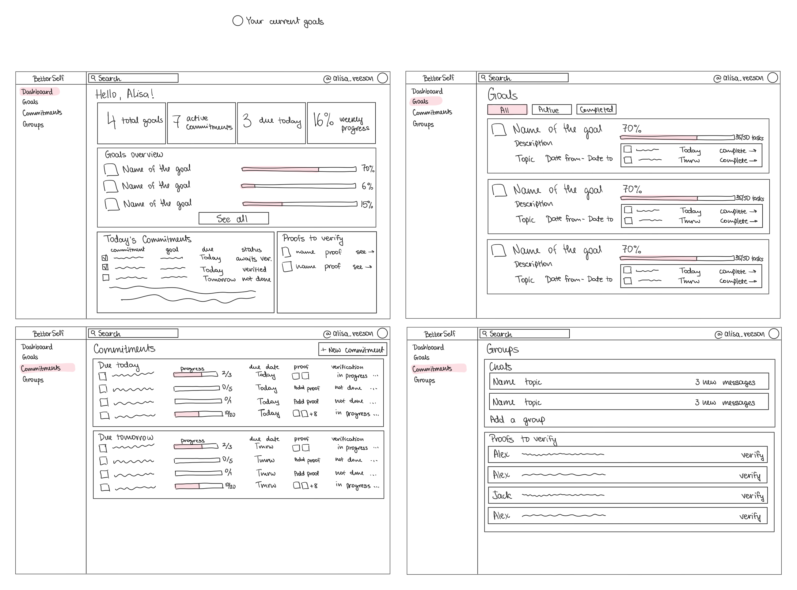

# P1: Project Design

## Problem Framing and Stakeholders

### Domain

This project focuses on **self-directed goal pursuit**: goals where people have to decide for themselves what actions to take, how much they can realistically commit to them, and whether those actions are actually producing progress.

Examples include getting an internship, improving grades, exercising consistently, building a professional network, or working on a personal project. Unlike externally structured tasks, these goals usually do not come with a clear plan or someone making sure the person follows it.

The problem mainly concerns three stages:

1. translating a desired outcome into realistic actions;
2. consistently carrying out those actions alongside other responsibilities;
3. evaluating whether those actions are producing meaningful progress and changing the plan when they are not.

The initial project will focus on academic, career-development, basic fitness/wellness, and personal-development goals. It will not provide medical, mental-health, legal, or investment advice.

### Stakeholders

- **Goal Setters.** Young adults pursuing self-directed goals. They decide what they want to achieve, but may struggle to choose the right actions, create a realistic workload, follow through consistently, or understand why progress is not happening.
- **Accountability Peers.** Other users pursuing similar or related goals. They can make commitments more visible, verify submitted evidence, and provide external accountability for goals that would otherwise stay private.

### Current Workflow

People usually begin with the outcome they want and then search for a strategy through friends, online advice, or AI. They turn some of that advice into tasks, habits, or schedules and try to follow the plan.

The harder part is understanding what went wrong when progress does not happen. The user may not have executed the plan consistently, the workload may have been unrealistic, or the strategy itself may have been ineffective.

These failures can look identical from the final outcome but require different responses. Failing to execute a reasonable strategy may call for a smaller workload or stronger accountability. Consistently executing an ineffective strategy calls for changing the strategy itself.

### Bad Situations

#### Situation 1: Knowing the outcome but not knowing what to change

A student wants better grades and finds many reasonable suggestions: attend office hours, start assignments earlier, study consistently, and do more practice. The harder question is which behavior is actually limiting their performance.

Without enough information to diagnose the problem, they try several changes without knowing what to prioritize. If their grades still do not improve, they may interpret the result as a lack of discipline even though they never had a clear basis for deciding what needed to change.

#### Situation 2: Too many goals, but no realistic way to prioritize them

An ambitious student wants to improve their GPA, exercise, work on a side project, prepare for recruiting, read regularly, and maintain a social life. Each goal seems individually reasonable, but the combined workload may not be.

When coursework, deadlines, and unexpected events take more time than expected, self-imposed commitments are easy to postpone because nobody else is waiting for them. Several goals disappear for weeks, and the student concludes that they lack discipline even though the original plan may simply have been unrealistic.

#### Situation 3: Following the plan without knowing whether the strategy works

A creator wants to grow an Instagram account and commits to posting four videos every week. They follow the plan consistently, but the account barely grows.

Their task tracker can show that the planned actions were completed, but not whether those actions were actually useful. The user now has to decide whether to continue, change the strategy, or abandon the goal without a structured way to distinguish execution from results.

### Corroboration

Strong intentions do not always translate into action. Webb and Sheeran (2006), reviewing 47 experiments, found that interventions produced substantially larger changes in intentions than in actual behavior.

Planning can also be unrealistically optimistic. Buehler, Griffin, and Ross (1994) found that honors students expected to finish their theses in 33.9 days on average, while the actual average was 55.5 days.

Clark et al. (2020), in field experiments with almost 4,000 college students, found that concrete task goals increased completion of targeted tasks, while broad performance goals had much smaller effects on course performance.

Harkin et al. (2016), in a meta-analysis of 138 studies involving 19,951 participants, found that increased progress monitoring improved goal attainment, with stronger effects when progress was reported to another person or made public.

Riddell et al. (2026), reviewing 235 studies and 1,421 effect sizes, found associations between goal-striving flexibility and goal-related outcomes, although the overall evidence quality was rated low-to-moderate.

The research supports the underlying problems, but it does not show that ambitious young adults are uniquely affected or that the same mechanisms work equally well for every type of goal.

### Current Workarounds and Comparables

People currently solve different parts of this problem with different tools.

- General-purpose AI assistants can help create a strategy, but users still need to track execution elsewhere and decide when the strategy should change.
- Task managers and habit trackers help organize and track actions, but they assume the user already knows which actions are worth doing.
- Friends and group chats can create accountability, but finding a consistent partner can be difficult and repeated check-ins may feel awkward.
- Products such as stickK and Beeminder add stronger accountability or stakes, but users still have to decide whether the commitment itself is realistic and whether completing it is actually producing the desired result.

The user still has to connect these pieces themselves: create a strategy, turn it into actions, execute those actions, interpret the results, and decide what should change.

The opportunity I want to explore is making that feedback loop itself the central workflow:

**desired outcome -> strategy -> commitments -> execution + proof -> observed results -> review -> revision**

---

## Application Pitch

### Motivation

People often know what they want to improve, but not what they should actually do to get there. They may want to get better grades, build a skill, find an internship, or become more consistent, but turning that outcome into the right actions is difficult.

If progress still does not happen, it is also hard to tell why: the strategy may be wrong for that person, the workload may be unrealistic, or the commitments may not be executed well enough.

BetterSelf is designed around both problems: figuring out what to do, and figuring out what should change when it is not working.

### Pitch

BetterSelf helps people turn a goal into a realistic strategy, follow through on concrete commitments, and revise the plan based on what actually happens.

Main functionality includes:

**Strategy to Commitments.** A user starts by describing the outcome they want, their current situation, constraints, timeline, and what success would look like. They can write their own strategy or ask AI to propose one. AI gives feedback either way and helps turn the strategy into concrete one-time and recurring commitments. The user stays in control of the final plan.

**Proof-Based Accountability.** A commitment is not completed with a simple checkbox. The user submits proof, initially through text or an image/screenshot. If the goal is connected to an accountability group, its commitments and proof are automatically visible there. Other members can verify or dispute the proof and discuss it in the shared group chat. The user's completion claim and peer verification are stored separately, so progress is not blocked just because nobody is online to verify immediately.

**Adaptive Review Loop.** Execution and results are tracked separately. Completing ten networking messages and receiving zero replies are two different signals. The user can manually start a review where AI looks at the strategy, execution history, submitted proof, and observed results. It can then propose a revised strategy or new commitments, which the user can approve, edit, or reject.

For goal setters, this creates one place for planning, execution, accountability, and adaptation instead of forcing them to connect several unrelated tools themselves. For accountability peers, it creates a lightweight structure for helping people with similar goals without requiring them to become coaches or constantly remind each other manually.

---

## Concept Design (spec and reactions)

### Concept 1: GoalPlanning [User]

```text
concept GoalPlanning [User]

purpose
    help a user define a self-directed goal and maintain a strategy for reaching it;
    allow the strategy to change when the user learns that the current approach is not working

principle
    user creates a goal by describing the desired outcome, current situation, constraints, timeline, and definition of success;
    user can write a strategy themselves or receive a proposed strategy from the application;
    the strategy can later be revised, but the user decides which version becomes the current strategy

state
    a set of Goals with
        an owner: User
        an outcome: String
        a currentContext: String
        a constraints: String
        a timeline: String
        a successDefinition: String
        a currentStrategy: a sequence of Steps

    a sequence of Steps with
        a description: String
        an successCriterion: String

actions
    createGoal(owner: User, outcome: String, currentContext: String, constraints: String, timeline: String, successDefinition: String) : (goal: Goal)
        then create a new Goal with this owner, outcome, currentContext, constraints, timeline, successDefinition, an empty currentStrategy, and return this Goal

    setStrategy(goal: Goal, strategy: sequence of Step)
        where goal exists and its currentStrategy is empty
        then set the goal's currentStrategy to strategy

    reviseStrategy(goal: Goal, strategy: sequence of Step)
        where goal exists and its currentStrategy is not empty
        then replace the goal's currentStrategy with strategy

    updateGoal(goal: Goal, outcome: String, currentContext: String, constraints: String, timeline: String, successDefinition: String)
        where goal exists
        then update the goal's outcome, currentContext, constraints, timeline, and successDefinition
    
    deleteGoal(goal: Goal)
        where goal exists
        then remove the goal from the set of Goals
```

**Notes:**
- AI can propose or critique a strategy, but the concept only stores the version the user chooses to use.
- A strategy is an ordered sequence of steps because some steps may depend on earlier ones.
- Each strategy step has its own success criterion, so the user can evaluate whether that part of the strategy is producing the expected result.
- Updating the goal does not automatically change the current strategy. For example, changing the timeline or constraints may make the existing strategy unrealistic, but deciding how the strategy should change happens separately.
- Deleting a goal only removes it from `GoalPlanning`; removing or retiring related commitments and group connections is handled through reactions with the other concepts.
---

### Concept 2: CommitmentTracking [Goal]

```text
concept CommitmentTracking [Goal]

purpose
    keep track of concrete actions a user commits to for a goal;
    separate planned actions from claims that those actions were actually completed

principle
    commitments are created for a goal as one-time or recurring actions;
    when an occurrence of a commitment is completed, a completion claim is recorded;
    commitments can be retired when the plan changes without deleting their previous execution history

state
    a set of Commitments with
        a goal: Goal
        a description: String
        a recurring: Flag
        a schedule: String
        an active: Flag

    a set of Completions with
        a commitment: Commitment
        an occurrence: DateTime

actions
    createCommitment(goal: Goal, description: String, recurring: Flag, schedule: String) : (commitment: Commitment)
        then create a new Commitment for this goal with this description, recurring and schedule, active = true, and return this Commitment

    claimComplete(commitment: Commitment, occurrence: DateTime) : (completion: Completion)
        where commitment exists and is active, and there is no Completion for this commitment and occurrence
        then create a Completion for this commitment and occurrence and return this Completion

    retireCommitment(commitment: Commitment)
        where commitment exists and is active
        then set active to false
```

**Notes / subtleties:**
- Completion is a user claim and is intentionally separate from peer verification.
- A recurring commitment can have multiple completions, one for each scheduled occurrence.
- The same scheduled occurrence cannot be completed more than once.
- Retiring a commitment prevents future completions but does not delete its past completions because they are still useful during later reviews.
- Completion itself does not store proof. Proof is handled separately by `ProofVerifying` and connected to the relevant commitment occurrence through reactions.
---

### Concept 3: ProofVerifying [User, Goal, Commitment, Evidence]

```text
concept ProofVerifying [User, Goal, Commitment, Evidence]

purpose
    require evidence for claimed execution;
    let other users verify whether submitted evidence actually supports the claimed completion

principle
    when a user completes a commitment, they submit evidence for that occurrence;
    other users can review that proof and mark it as verified or disputed;
    verification is stored separately from the user's own completion claim

state
    a set of Proofs with
        a submitter: User
        a goal: Goal
        a commitment: Commitment
        an occurrence: DateTime
        an evidence: Evidence
        a set of Verifications

    a set of Verifications with
        a reviewer: User
        a decision: VerificationDecision
        a note: String

    VerificationDecision = verified | disputed

actions
    submitProof(submitter: User, goal: Goal, commitment: Commitment, occurrence: DateTime, evidence: Evidence) : (proof: Proof)
        where there is no Proof for this commitment and occurrence
        then create a new Proof with this submitter, goal, commitment, occurrence, evidence, and no Verifications, and return this Proof

    reviewProof(reviewer: User, proof: Proof, decision: VerificationDecision, note: String)
        where proof exists, reviewer is not the proof's submitter, and this reviewer has not already reviewed this proof
        then create a Verification with this reviewer, decision, and note and add it to the Proof's Verifications
```

**Notes / subtleties:**

- In the first version, `Evidence` will be instantiated as text or an uploaded image/screenshot.
- A proof is pending when it has no peer verification yet.
- Peer review does not block the user's progress. The system can still distinguish between claimed completion, verified proof, and disputed proof.

---

### Concept 4: AccountabilityGrouping [User, Goal, Proof]

```text
concept AccountabilityGrouping [User, Goal, Proof]

purpose
    create small groups where people pursuing related goals can make progress visible and hold one another accountable

principle
    a user creates or joins a group around a shared topic;
    a goal can be connected to one accountability group;
    proofs from that goal are automatically shared with the group;
    members can discuss progress in a shared chat and reply to a specific proof

state
    a set of Groups with
        a name: String
        a topic: String
        a set of Members
        a set of Goals
        a set of SharedProofs
        a set of Messages

    a set of Messages with
        an author: User
        a text: String
        a replyToProof: Proof?

actions
    createGroup(owner: User, name: String, topic: String) : (group: Group)
        then create a new Group with this name and topic, owner as its first member, no Goals, no SharedProofs, no Messages, and return this Group

    joinGroup(group: Group, user: User)
        where group exists and user is not already a member
        then add user to the group's Members

    attachGoal(group: Group, user: User, goal: Goal)
        where group exists, user is a member of this group, and goal is not attached to any other Group
        then add goal to this group's Goals

    shareProof(goal: Goal, proof: Proof)
        where a Group exists that contains this goal
        then add proof to that Group's SharedProofs

    postMessage(group: Group, author: User, text: String, replyToProof?: Proof)
        where group exists, author is a member of this group, and if replyToProof is provided, it is in this Group's SharedProofs
        then create a Message with this author, text, and optional replyToProof and add it to the Group's Messages

    checkMember(goal: Goal, user: User) : (group: Group)
        where a Group exists that contains this goal and user is a member of this Group
        then return this Group
```

**Notes / subtleties:**
- In the first version, one goal can belong to at most one accountability group.
- Users manually find and join groups. Automatic group recommendations based on goals can be added later.
- The group is not a public social-media feed. It is a smaller accountability space tied to related goals.
- Replies to proofs appear inside the shared group chat instead of creating a separate comment thread for every proof.

---

### Concept 5: ProgressReviewing [Goal, Commitment, Proof]

```text
concept ProgressReviewing [Goal, Commitment, Proof]

purpose
    compare execution with observed results and help decide what should change next;
    prevent successful task completion from being treated as proof that the strategy itself is working

principle
    a user records results that happened while pursuing a goal;
    when the user starts a review, the application analyzes the current strategy, commitment execution, proof, and observed results;
    the review can propose changes to the strategy or future commitments;
    the user can accept, edit, or reject the proposed changes

state
    a set of Results with
        a goal: Goal
        a description: String
        an timestamp: DateTime

    a set of Reviews with
        a goal: Goal
        a summary: String
        a suggestedStrategy: String
        a suggestedCommitments set of Strings
        a decision: ReviewDecision

    ReviewDecision = pending | accepted | edited | rejected

actions
    recordResult(goal: Goal, description: String, timestamp: DateTime) : (result: Result)
        then create a new Result with this goal, description, and timestamp and return this Result

    createReview(goal: Goal, summary: String, suggestedStrategy: String, suggestedCommitments: set of Strings) : (review: Review)
        then create a new Review for this goal with this summary, suggestedStrategy, suggestedCommitments, decision = pending, and return this Review

    resolveReview(review: Review, decision: ReviewDecision)
        where review exists, review.decision = pending, and decision is accepted, edited, or rejected
        then set the Review's decision to decision
```

**Notes / subtleties:**
- Reviews are started manually in the first version. Scheduled reviews can be added later.
- The AI analysis itself is an implementation mechanism. This concept stores the result of that analysis and the user's decision about it.
- Accepted or edited review suggestions can trigger changes in `GoalPlanning` and `CommitmentTracking` through reactions.

---

## Essential Reactions

### Completing a Commitment Requires Proof

```text
reaction submitProofForCompletion
    where Requesting.completeCommitment (user, goal, commitment, occurrence, evidence)
    then ProofVerifying.submitProof (submitter: user, goal, commitment, occurrence, evidence)

reaction recordCompletion
    where ProofVerifying.submitProof (submitter: user, goal, commitment, occurrence, evidence) : (proof)
    then CommitmentTracking.claimComplete (commitment, occurrence)
```

A user cannot complete a commitment through a simple checkbox. The completion flow starts by submitting proof, and a successful proof submission triggers the completion claim.

### Automatically Share Proof With the Accountability Group

```text
reaction shareProof
    where ProofVerifying.submit (submitter: user, goal, commitment, occurrence, evidence) : (proof)
    then AccountabilityGrouping.shareProof (goal, proof)
```

If the goal is attached to an accountability group, the proof becomes visible there automatically. The user does not need to manually share every completed commitment.

### Only Group Members Can Verify Proof

```text
reaction checkVerificationAccess
    where Requesting.reviewProof (reviewer, goal, proof, decision, note)
    then AccountabilityGrouping.checkMember (goal, reviewer)

reaction verifyProof
    where Requesting.reviewProof (reviewer, goal, proof, decision, note) and AccountabilityGrouping.checkMember (goal, reviewer)
    then ProofVerifying.review (reviewer, proof, decision, note)
```

Verification is available only to members of the accountability group connected to that goal.

### Apply an Accepted Review

```text
reaction reviseStrategy
    where ProgressReviewing.resolve (review, decision: accepted)
    then GoalPlanning.reviseStrategy (goal: review.goal, strategy: review.suggestedStrategy)
```

An accepted review can update the active strategy. Similar reactions can retire old commitments and create the new commitments proposed by the review.

---

## Concept Roles in the Application

`GoalPlanning` stores the user's goal and current strategy. `CommitmentTracking` represents the concrete actions created from that strategy and records when the user claims they were completed. `ProofVerifying` stores evidence separately from completion and lets accountability peers verify or dispute that evidence.

`AccountabilityGrouping` provides the multi-user layer by connecting a goal to a small group where its commitments and proofs can be seen and discussed. `ProgressReviewing` stores observed results and review suggestions, allowing the application to compare execution with outcomes and propose changes to the strategy or future commitments.

Reactions connect these concepts into the main workflow without making them depend directly on one another.

The generic `User` type represents application users. `Goal`, `Commitment`, and `Proof` refer to objects created by `GoalPlanning`, `CommitmentTracking`, and `ProofVerifying`. `Evidence` will initially be text or an uploaded image/screenshot.

---

## UI Sketches

The sketches below show the main screens of BetterSelf and how users move between their goals, commitments, and accountability groups.



### Dashboard

The dashboard gives the user a quick overview of everything that currently needs attention across the app.

At the top, the user can see basic summary information such as the number of active goals, active commitments, commitments due today, and overall weekly progress.

The **Goals Overview** shows the user's current goals and their progress without requiring the user to open each goal separately. The dashboard also shows today's commitments from different goals in one place, including their current status.

A separate **Proofs to Verify** section surfaces evidence submitted by other members of the user's accountability groups so that verification does not get lost inside individual group chats.

### Goals

The Goals screen shows all of the user's goals. The user can filter between all, active, and completed goals.

Each goal card contains the basic goal information, its timeline, overall progress, and some of its current commitments. Selecting a goal would open the more detailed goal view with its strategy, commitments, results, and reviews.

This screen is meant to answer two quick questions: what goals am I currently pursuing, and how far have I progressed on each one?

### Commitments

The Commitments screen brings concrete actions from all goals into one place.

Commitments are grouped by when they are due, such as **Due Today** and **Due Tomorrow**. Each row shows:

- whether the commitment has been completed;
- progress for commitments that involve multiple actions;
- its due date;
- whether proof has been submitted;
- its current verification status.

The user can also create a new commitment from this screen.

This view separates the user's higher-level goals from the actions they actually need to complete in the near term.

### Groups

The Groups screen contains the multi-user accountability part of BetterSelf.

The top section shows the accountability groups the user has joined and any new messages in their group chats. Users can also add or join another group.

The **Proofs to Verify** section shows proof submitted by other group members that still needs peer verification. From here, the user can open the relevant proof and verify or dispute whether it supports the claimed completion.

This keeps group communication and peer accountability in one place while still making proof verification easy to find.

## User Journey

Maya is a college student preparing for software engineering recruiting. She wants to get an internship but is not sure which actions will actually help, and her self-imposed recruiting tasks are easy to postpone when coursework gets busy.

She creates a goal in BetterSelf: **get a software engineering internship for next summer**. She describes her current context, constraints, timeline, and definition of success, then creates a strategy with AI feedback. Once the goal is active, it appears with her other goals in the **Goals screen (Figure 1)**, where she can quickly see its progress and current commitments.

During the week, Maya mainly works from the **Dashboard (Figure 2)** and **Commitments screen (Figure 3)**. The dashboard gives her an overview of all her goals and shows which commitments are due today. The Commitments screen gives her a more detailed view of upcoming actions, including their progress, due dates, proof, and verification status. When Maya completes a commitment, she submits proof instead of only checking it off.

Maya also joins a recruiting accountability group. In the **Groups screen (Figure 4)**, she can see the group chat as well as proofs submitted by other members that still need verification. Her own proof is shared with the relevant group, where another member can verify or dispute it and respond in the group conversation.

Over time, BetterSelf can compare Maya's execution with her actual results. For example, she may consistently complete and prove her networking commitments but still receive very few replies. This suggests that the problem may be the strategy rather than her execution. BetterSelf can then help her revise the strategy and create a different set of future commitments.

The result is that Maya can see not only whether she is doing what she planned, but also whether those actions are actually helping her reach the goal and what should change when they are not.

---

## References

Buehler, R., Griffin, D., & Ross, M. (1994). Exploring the "planning fallacy": Why people underestimate their task completion times. *Journal of Personality and Social Psychology, 67*(3), 366–381.

Clark, D., Gill, D., Prowse, V. L., & Rush, M. (2020). Using goals to motivate college students: Theory and evidence from field experiments. *The Review of Economics and Statistics, 102*(4), 648–663.

Harkin, B., Webb, T. L., Chang, B. P. I., Prestwich, A., Conner, M., Kellar, I., Benn, Y., & Sheeran, P. (2016). Does monitoring goal progress promote goal attainment? A meta-analysis of the experimental evidence. *Psychological Bulletin, 142*(2), 198–229.

Riddell, H., Sedikides, C., Sivaramakrishnan, H., et al. (2026). A meta-analytic review and conceptual model of the antecedents and outcomes of goal adjustment in response to striving difficulties. *Nature Human Behaviour, 10*, 317–332.

Webb, T. L., & Sheeran, P. (2006). Does changing behavioral intentions engender behavior change? A meta-analysis of the experimental evidence. *Psychological Bulletin, 132*(2), 249–268.